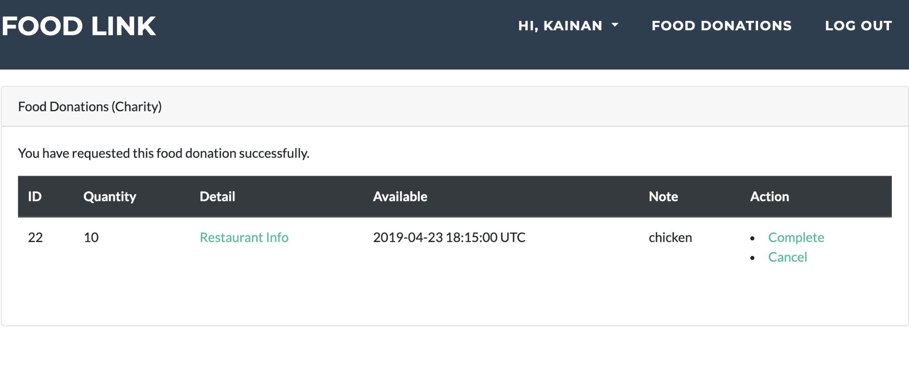

# FoodLink User Guide

FoodLink is a food donation platform that aims to bring together local restaurants and charities to reduce food waste and help those in need. As such, this platform is intended to be used by both restaurant employees and non-profit organization employees.

## Getting Started

### Sign up

Create a new account by typing in your email address, password, and home/office address.

If you are creating an account as a restaurant employee, select the **Restaurant** option. Similarly, if you are employed by a charity organization, select **Charity**.

### Confirm your account

Once the sign up form has been submitted, you’ll receive a confirmation email to the email address you provided. Click on the confirmation link to verify your new account. You will be redirected to the login page with a success message.

## Logging in

Use your email address and password to sign in. 

As a reminder, you must have confirmed your email address in order to log in.

## Edit your Profile

Once you’ve logged into the system, if you want to edit personal information such as your name, address, or phone number, you can do so in the **Profile** tab. 

Hover over your name in the navigation bar. A dropdown menu will appear, where you can select “Profile”. Here you’ll be able to update any personal details.

## Edit Account Information

If you want to change your password or cancel your account, head over to the **Account** tab.

Hover over your name in the navigation bar. A dropdown menu will appear, where you can select “Account”. 

## Manage Food Donations

Select “food donations” in the navigation bar, to manage the food donations linked to your organization.

### For Restaurants

When a charity accepts one of your available donations, you will be notified via email. The donation will be marked as pending for both parties, until it is completed.

#### View pending food donations

On the **food donations** page, you can view pending food donations, create new donations, and export past donations to a csv file for tax purposes.

#### Create new food donation

To create a new donation, select “new food donation” and fill out the form details that should be displayed to charities.

#### Export your donation history

Select “export donation history” to download a csv file containing all of your recorded donations.

### For Charities

#### View available food donations

On the **food donations** page, you can view all available restaurant donations in your area. When you’ve found one that interests you, select “request” on the far right column of the corresponding entry. 

> [!TIP]
> You may only request one donation at a time.

> [!NOTE]
> Once you’ve requested a specific donation, you will receive an email confirmation.

#### Marking an order as Complete

When your charity receives a donation successfully, mark the order as complete. You can find the "Complete" button on the far right column for the given entry.

#### Canceling an order 

In the event you want to cancel, you must do so 48 hours before scheduled delivery time. 
The "cancel" button will disappear from the page after the time window has passed.

## Logging Out

Select “log out” in the top right hand corner of the navigation bar to end your session.

