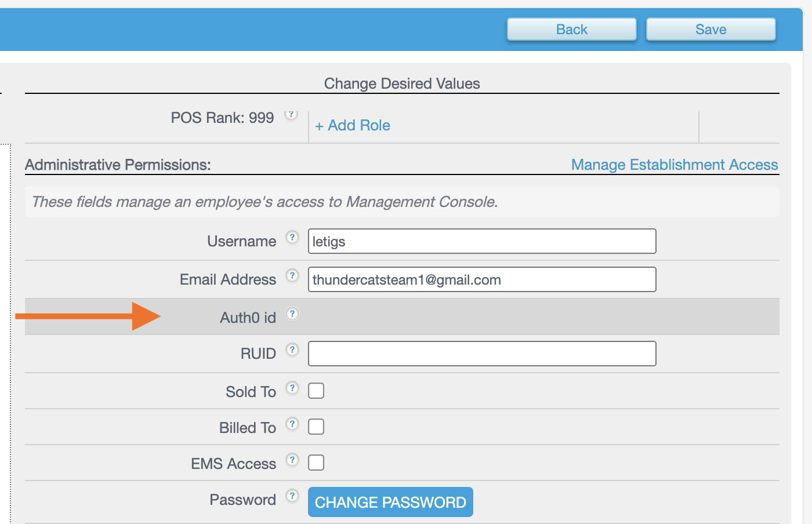
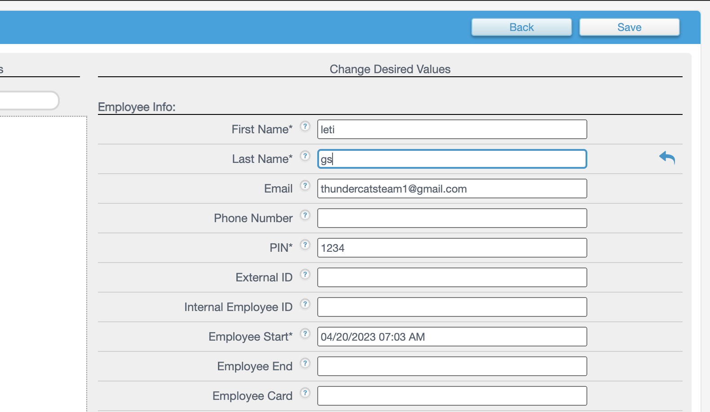
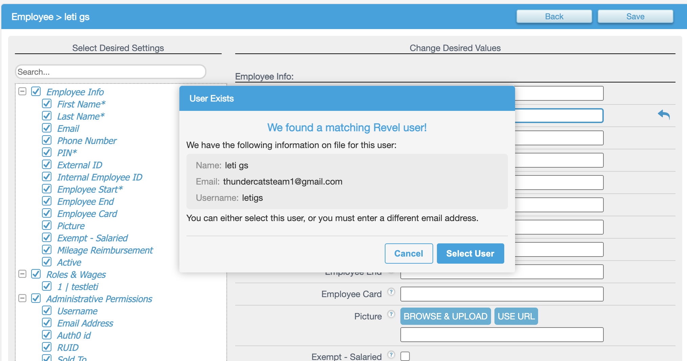
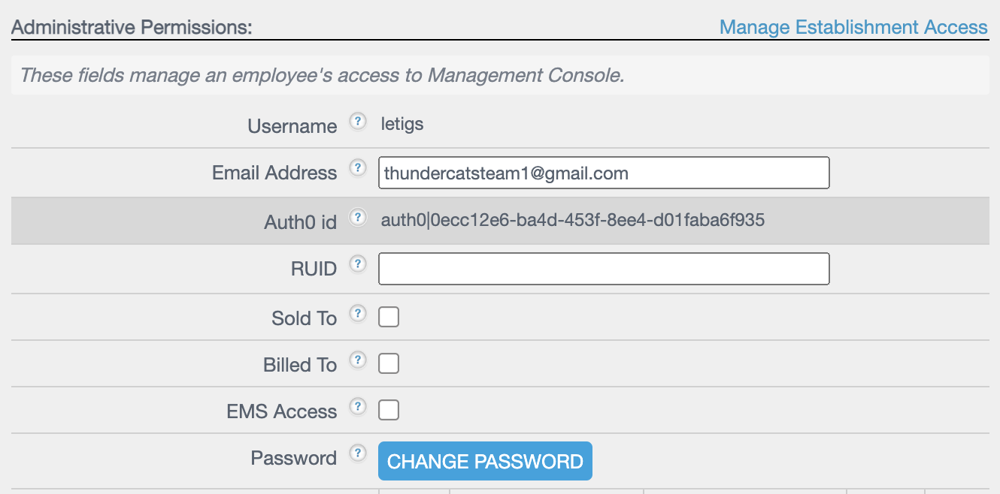
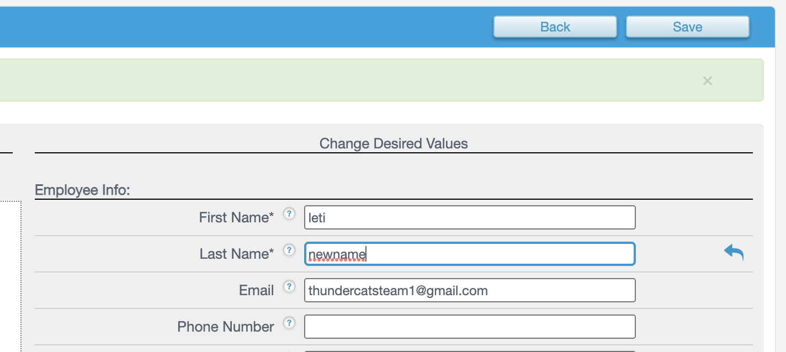

# Support/Fulfillment: Edit a new instance's first employee

When Auth0 is the source of truth, i.e. the Auth0 Feature Flag is switched on, the first employee on a customer instance will be created in both Management Console (MC) and Auth0. However, these entities will not be linked until the employee logs into the MC for the first time. 

This can be observed when navigating to said employee's detail page in MC. The Auth0 Id form field will be empty.

If the need arises for support or fulfillment to edit this employee's personal information in MC **before** said employee has ever logged in, the following steps should be taken:

1. Navigate to the corresponding employee detail page.

2. Click into any form field. *Don't type anything.* Just hit Save.

3. You will be prompted with a popup asking for consent to merge the employee and Auth0 user. Click on Select User to proceed.

4. The MC employee is now synced with Auth0. You can verify this by observing the non-empty Auth0 Id field.

5. Now you can safely edit any form fields, then hit Save.

6. The employee/user will be updated in both MC and Auth0!